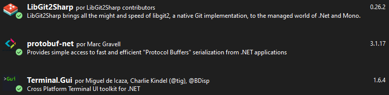

# 📦 EnvLoad
[](https://twitter.com/d4nijerez) 

EnvLoad is a little local program that loads environment variables into the operating system.
Environment variables are stored in repositories (public or private) in json files classified by project and with the following structure.
[Example](https://github.com/danijerez/envload/blob/envs/envload_local.json)
```
{
    "project": "envload",
    "environment": "local",
    "values": [
        {
            "name": "env1",
            "value": "1"
        },
        {
            "name": "env2",
            "value": "2"
        },
        {
            "name": "env3",
            "value": "3"
        }
    ]
}
```

I've actually created it for my own use, it's a hassle having to set up a local environment and forgetting to remove the settings before committ. It is open source in case you want to use it or improve it.

 




The configuration is saved in a binary file 'settings.bin' encrypted with the library [protobuf-net](https://github.com/protobuf-net/protobuf-net). The interface is simple (very improvable), designed with the library [Terminal.Gui](https://github.com/migueldeicaza/gui.cs/) and the connection with the repositories is thanks to [LibGit2Sharp](https://github.com/libgit2/libgit2sharp/). 

If you use it or have any suggestions comment! ✌️
